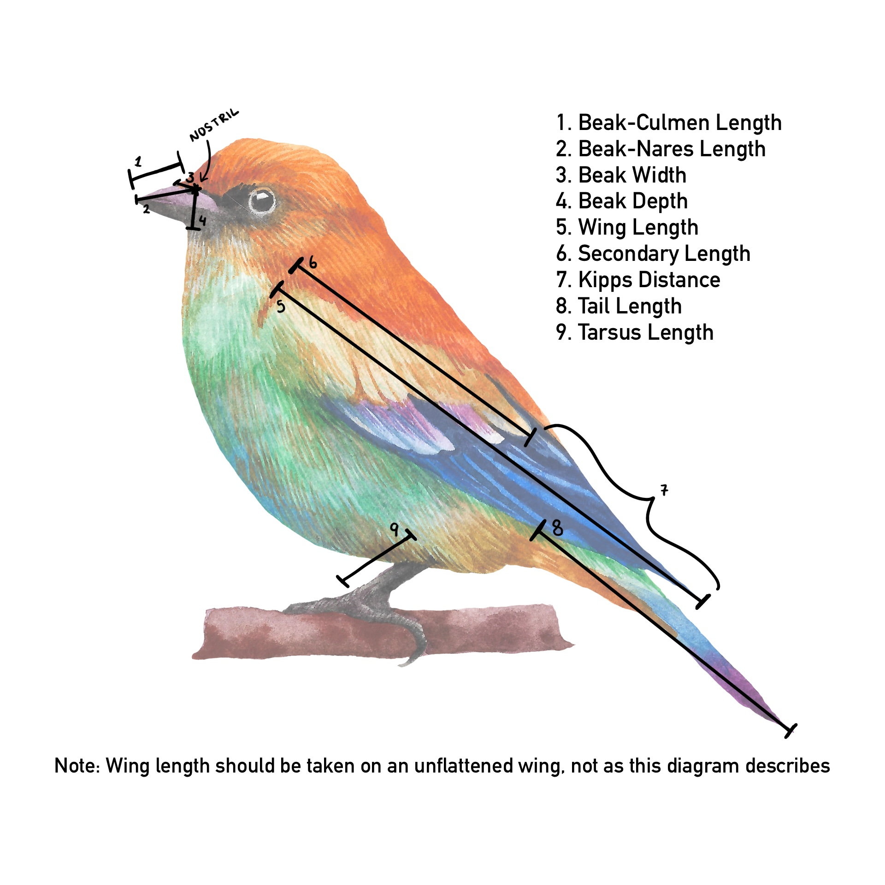

```{r load-packages, include = FALSE}
# Add any additional packages you need to this chunk
library(tidyverse)
library(tidymodels)
library(palmerpenguins)
library(knitr)
library(xaringanthemer)
library(devtools)
library(ggplot2)
library(gridExtra)
library(tidymodels)
library(readxl)
library(xaringan)
```

```{r setup, include=FALSE}
# For better figure resolution
knitr::opts_chunk$set(fig.retina = 3, dpi = 300, fig.width = 6, fig.asp = 0.618, out.width = "80%")
```

```{r load-data, include=FALSE}
birds_data_og <- read_csv("birds_data.csv")

birds_data <- birds_data_og %>%
  select(Species1, Family1, Order1, Avibase.ID1, Total.individuals,
         Complete.measures, Beak.Length_Culmen, Beak.Length_Nares, Beak.Width, Beak.Depth, 
         Tarsus.Length, Wing.Length, Kipps.Distance, Secondary1, Tail.Length, 
         Trophic.Level, Trophic.Niche) %>%
  rename("Species_Name" = "Species1", "Family" = "Family1", "Order" = "Order1",
         "Species_ID" = "Avibase.ID1",
         "Secondary_Length" = "Secondary1",
         "Complete_Measures" = "Complete.measures", "Total_Individuals" = "Total.individuals",
         "Beak_Culmen_Length" = "Beak.Length_Culmen", "Beak_Nares_Length" = "Beak.Length_Nares",
         "Beak_Width" = "Beak.Width", "Beak_Depth" = "Beak.Depth", "Tarsus_Length" = "Tarsus.Length",
         "Wing_Length" = "Wing.Length", "Kipps_Distance" = "Kipps.Distance", "Tail_Length" = "Tail.Length",
         "General_Trophic" = "Trophic.Level", 
         "Niche_Trophic" = "Trophic.Niche") %>%
  relocate(Species_ID, .before = Species_Name)
```

#Steps We Took To Tidy The Data

#Firstly we checked the data for NA's
```{r data tidying code, echo=TRUE}
birds_data_og %>% 
  select(where(~ any(is.na(.)))) %>% 
  summarise(
    across(everything(),
           ~sum(is.na(.))))
```

---
#Then we selected the columns that were useful to our investiagtion

```{r data Tidying select, echo=TRUE}
birds_data_select <- birds_data_og %>%
  select(Species1, Family1, Order1, Avibase.ID1, Total.individuals, Female, Male, Unknown,
         Complete.measures, Beak.Length_Culmen, Beak.Length_Nares, Beak.Width, Beak.Depth, 
         Tarsus.Length, Wing.Length, Kipps.Distance, Secondary1, `Hand-Wing.Index`, Tail.Length, 
         Mass, Habitat, Habitat.Density, Migration, Trophic.Level, Trophic.Niche, 
         Primary.Lifestyle, Range.Size) 

```
---
#We then renamed the column's that had unclear names
```{r rename data tidying, echo=TRUE}
birds_data_rename <- birds_data_select%>%
  rename("Species_Name" = "Species1", "Family" = "Family1", "Order" = "Order1",
         "Species_ID" = "Avibase.ID1", "Unknown_M/F" = "Unknown", 
         "Secondary_Length" = "Secondary1","Avg_Mass" = "Mass",
         "Hand_Wing_Index" = "Hand-Wing.Index","Complete_Measures" = "Complete.measures", 
         "Total_Individuals" = "Total.individuals","Beak_Culmen_Length" = "Beak.Length_Culmen", 
         "Beak_Nares_Length" = "Beak.Length_Nares","Beak_Width" = "Beak.Width", 
         "Beak_Depth" = "Beak.Depth", "Tarsus_Length" = "Tarsus.Length",
         "Wing_Length" = "Wing.Length", "Kipps_Distance" = "Kipps.Distance", 
         "Tail_Length" = "Tail.Length","Habitat_Density" = "Habitat.Density", 
         "General_Trophic" = "Trophic.Level", "Niche_Trophic" = "Trophic.Niche", 
         "Primary_Lifestyle" = "Primary.Lifestyle","Range_Size" = "Range.Size")
```
---
#Finally we relocated the Species ID to come before the Species Name
```{r relocate data tidying, include=TRUE}
birds_data_relocate <- birds_data_rename%>%
  relocate(Species_ID, .before = Species_Name)
```

---

class: center, middle

##Investigating the Corellation Between The Diet of Birds and Their Beak Measurement

Our aim is to prove that birds with similar diets will have similar beak sizes.
---

class:center, middle
#What Is A Bird's Beak Measurements
```{r Beak Size Image, echo=FALSE, out.width= "50%"}

```
---
#What are the Differeing Diets of Birds
```{r Diets of Birds Graph, echo=FALSE, out.width= "20%"}
birds_data %>%
  filter(!General_Trophic == "NA")%>%
  ggplot(aes(x = General_Trophic)) +
  geom_bar(fill = "skyblue", color = "black") +
  labs(title = "Distribution of Trophic Levels",
       x = "Trophic Level",
       y = "Count")+
  theme_bw()
```

```{r pie chart, echo=FALSE, out.width= "20%"}
trophic_colors <- c("Herbivore" = "darkgreen",
                    "Carnivore" = "tomato3",
                    "Omnivore" = "steelblue",
                    "Scavenger" = "wheat")

birds_data %>%
  filter(!is.na(General_Trophic)) %>%
  ggplot(aes(x = "", fill = General_Trophic)) +
  geom_bar(width = 1, stat = "count") +
  coord_polar(theta = "y") +
  scale_fill_manual(values = trophic_colors, name = "Trophic Type") +  # Assign colors and change legend name
  guides(fill = guide_legend(title = "Trophic Type")) +  # Change legend name
  labs(title = "Distribution of Trophic Types") +
  theme(axis.text = element_blank(),  # Remove axis text
        axis.title = element_blank(),  # Remove axis title
        legend.position = "bottom")  # Move legend to the bottom
```
---
#Some Graphsssss whooooo
---
#Prediciting The Diet Of The Bird Based Of Their Beak Measurements

When creating our models we decided to focus on predicting the diets of birds who are:
- Carnivores: A species whose diet consists of at least 70% of food resources from consuming live animals.
- Herbivores: A species whose diet consists of at least 70% of food resources from consuming plants.

We decided to leave out scavenger birds since they make up less than 1% of our data and so using them may of led to false predictions.

We also left out Omnivores, this was due to the overlapping diets that they have in correlation to Carnivores and Herbivores. An Omnivore is a species whose diet consists of a mixed consumption of plants and animals at an approximately equal rate. This means that their beak measurements doesn't have as definite relationships as the Carnivores and Herbivores, which may have also lead to false predictions.

---

#Prediciting Whether a Bird is a Carnivore
```{r Bird Model data tidying, include=FALSE}
birds_model <- birds_data %>%
  filter(!General_Trophic == "NA") %>%
  mutate(
    Carnivore_Status = factor(ifelse(General_Trophic == "Carnivore", "Carnivore", "Not Carnivore"),
                              levels = c("Not Carnivore", "Carnivore")),
    
    Herbivore_Status = factor(ifelse(General_Trophic == "Herbivore", "Herbivore", "Not Herbivore"),
                              levels = c("Not Herbivore", "Herbivore")),
    
    Omnivore_Status = factor(ifelse(General_Trophic == "Omnivore", "Omnivore", "Not Omnivore"),
                             levels = c("Not Omnivore", "Omnivore")))


#splitting our data

# Set seed for reproducibility
set.seed(123)
# Create an initial split (e.g., 80% training, 20% testing)
split_data <- initial_split(birds_model, prop = 0.8)
train_data <- training(split_data)
test_data <- testing(split_data)
```

```{r Workflow Model for Carnivore, include=FALSE}
#model for predicting if a carnivore or not based on beak data (model C)
birds_rec_C <- recipe(Carnivore_Status ~ Beak_Nares_Length + Beak_Width + Beak_Depth, data = train_data) %>%
  step_dummy(all_nominal(), -all_outcomes())

birds_mod_C <- logistic_reg() %>%
  set_engine("glm")

birds_wflow_C <- workflow() %>%
  add_recipe(birds_rec_C) %>%
  add_model(birds_mod_C)

birds_wflow_C

#fit c
birds_fit_C <- birds_wflow_C %>%
  fit(data = train_data)

# Making the predictor
birds_predict_C <- predict(birds_fit_C, test_data, type = "prob") %>%
  bind_cols(test_data)

# ROC for carnivore
roc_Carnivore <- birds_predict_C %>%
  roc_curve(truth = Carnivore_Status, ".pred_Carnivore", event_level = "second")
```

```{r Graph for Model for Carnivore, echo=FALSE}
# Plot ROC for carnivore
autoplot(roc_Carnivore) +
  labs(title = "ROC Curve for prediciting Carnivores",
       subtitle = "Using Beak Nares Length, Beak Width and Beak Depth")

```
---
#Prediciting Whether a Bird is a Carnivore
```{r area under the curve for carnivore, echo=TRUE}
birds_predict_C%>%
  roc_auc(truth = Carnivore_Status, ".pred_Carnivore", event_level = "second")
```

- This calculates the area under the curve. 
- Our value for this area 0.64 which is greater than 0.5 which is said to be random choice.
---

#Prediciting Whether a Bird is a Herbivore
```{r Workflow Model for Herbivore, include=FALSE}
#model for herbivores

birds_rec_h <- recipe(Herbivore_Status ~ Beak_Nares_Length + Beak_Width + Beak_Depth, data = train_data) %>%
  step_dummy(all_nominal(), -all_outcomes())

birds_mod_h <- logistic_reg() %>%
  set_engine("glm")

birds_wflow_h <- workflow() %>%
  add_recipe(birds_rec_h) %>%
  add_model(birds_mod_h)

birds_wflow_h

#fit h
birds_fit_h <- birds_wflow_h %>%
  fit(data = train_data)

# Making the predictor
birds_predict_h <- predict(birds_fit_h, test_data, type = "prob") %>%
  bind_cols(test_data)
```

```{r Graph for Model for Herbivore, echo=FALSE}
# ROC for herbivore
roc_Herbivore <- birds_predict_h %>%
  roc_curve(truth = Herbivore_Status, ".pred_Herbivore", event_level = "second")

# Plot ROC for herbivore
autoplot(roc_Herbivore) +
  labs(title = "ROC Curve for predicting Herbivores",
       subtitle = "Using Beak Nares Length, Beak Width and Beak Depth")
```
---

#Prediciting Whether a Bird is a Herbivore
```{r area under the curve for Herbivore, echo=TRUE}
birds_predict_h %>%
  roc_auc(truth = Herbivore_Status, ".pred_Herbivore", event_level = "second")
```
---
#Results of our Investigation