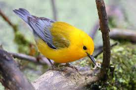

background-image: url(https://images.unsplash.com/photo-1470167494176-c2e966a4eb3d?q=80&w=2342&auto=format&fit=crop&ixlib=rb-4.0.3&ixid=M3wxMjA3fDB8MHxwaG90by1wYWdlfHx8fGVufDB8fHx8fA%3D%3D)
background-position: top center

```{r load-packages, include = FALSE}
# Add any additional packages you need to this chunk
library(tidyverse)
library(tidymodels)
library(palmerpenguins)
library(knitr)
library(xaringanthemer)
library(ggplot2)
library(gridExtra)
library(tidymodels)
library(readxl)
library(xaringan)
```

```{r setup, include=FALSE}
# For better figure resolution
knitr::opts_chunk$set(fig.retina = 3, dpi = 300, fig.width = 6, fig.asp = 0.618, out.width = "80%")
```

```{r load-data, include=FALSE}
birds_data_og <- read_csv("birds_data.csv")

birds_data <- birds_data_og %>%
  select(Species1, Family1, Order1, Avibase.ID1, Total.individuals,
         Complete.measures, Beak.Length_Culmen, Beak.Length_Nares, Beak.Width, Beak.Depth, 
         Tarsus.Length, Wing.Length, Kipps.Distance, Secondary1, Tail.Length, 
         Trophic.Level, Trophic.Niche) %>%
  rename("Species_Name" = "Species1", "Family" = "Family1", "Order" = "Order1",
         "Species_ID" = "Avibase.ID1",
         "Secondary_Length" = "Secondary1",
         "Complete_Measures" = "Complete.measures", "Total_Individuals" = "Total.individuals",
         "Beak_Culmen_Length" = "Beak.Length_Culmen", "Beak_Nares_Length" = "Beak.Length_Nares",
         "Beak_Width" = "Beak.Width", "Beak_Depth" = "Beak.Depth", "Tarsus_Length" = "Tarsus.Length",
         "Wing_Length" = "Wing.Length", "Kipps_Distance" = "Kipps.Distance", "Tail_Length" = "Tail.Length",
         "General_Trophic" = "Trophic.Level", 
         "Niche_Trophic" = "Trophic.Niche") %>%
  relocate(Species_ID, .before = Species_Name)
```

```{r Background image, include=FALSE}

#Background image
style_xaringan(
  title_slide_background_image = "Background photo of birds.jpeg",
  inverse_text_color = "white",
  inverse_text_shadow = TRUE)
  
```


#Our Data
We chose the AVONET data set (2) which outlines functional trait data for all birds including data on:
- Species
- Habitat
- Trophic (diet)
- Different Beak size data including: Beak width, Beak Depth and two measures of Beak length...


```{r showing the data, echo=FALSE}
birds_data %>%
  select(Species_Name, Family, Beak_Nares_Length, Beak_Depth, Beak_Width, General_Trophic, Niche_Trophic) %>%
  print(n = 10)
```

---
background-image: url(https://images.unsplash.com/photo-1470167494176-c2e966a4eb3d?q=80&w=2342&auto=format&fit=crop&ixlib=rb-4.0.3&ixid=M3wxMjA3fDB8MHxwaG90by1wYWdlfHx8fGVufDB8fHx8fA%3D%3D)


#Steps We Took to Tidy The Data

##Firstly, we checked the Data for NA's
```{r data tidying code, echo=TRUE}
birds_data_og %>% 
  select(where(~ any(is.na(.)))) %>% 
  summarise(
    across(everything(),
           ~sum(is.na(.))))
```

---
background-image: url(https://images.unsplash.com/photo-1470167494176-c2e966a4eb3d?q=80&w=2342&auto=format&fit=crop&ixlib=rb-4.0.3&ixid=M3wxMjA3fDB8MHxwaG90by1wYWdlfHx8fGVufDB8fHx8fA%3D%3D)
##Then we Selected the Columns that were Useful to our Investigation

```{r data Tidying select, echo=TRUE}
birds_data_select <- birds_data_og %>%
  select(Species1, Family1, Order1, Avibase.ID1, Total.individuals, Female, Male, Unknown,
         Complete.measures, Beak.Length_Culmen, Beak.Length_Nares, Beak.Width, Beak.Depth, 
         Tarsus.Length, Wing.Length, Kipps.Distance, Secondary1, `Hand-Wing.Index`, Tail.Length, 
         Mass, Habitat, Habitat.Density, Migration, Trophic.Level, Trophic.Niche, 
         Primary.Lifestyle, Range.Size) 

```
---
background-image: url(https://images.unsplash.com/photo-1470167494176-c2e966a4eb3d?q=80&w=2342&auto=format&fit=crop&ixlib=rb-4.0.3&ixid=M3wxMjA3fDB8MHxwaG90by1wYWdlfHx8fGVufDB8fHx8fA%3D%3D)
##We then Renamed the Column's that had Unclear Names
```{r rename data tidying, echo=TRUE}
birds_data_rename <- birds_data_select%>%
  rename("Species_Name" = "Species1", "Family" = "Family1", "Order" = "Order1",
         "Species_ID" = "Avibase.ID1", "Unknown_M/F" = "Unknown", 
         "Secondary_Length" = "Secondary1","Avg_Mass" = "Mass",
         "Hand_Wing_Index" = "Hand-Wing.Index","Complete_Measures" = "Complete.measures", 
         "Total_Individuals" = "Total.individuals","Beak_Culmen_Length" = "Beak.Length_Culmen", 
         "Beak_Nares_Length" = "Beak.Length_Nares","Beak_Width" = "Beak.Width", 
         "Beak_Depth" = "Beak.Depth", "Tarsus_Length" = "Tarsus.Length",
         "Wing_Length" = "Wing.Length", "Kipps_Distance" = "Kipps.Distance", 
         "Tail_Length" = "Tail.Length","Habitat_Density" = "Habitat.Density", 
         "General_Trophic" = "Trophic.Level", "Niche_Trophic" = "Trophic.Niche", 
         "Primary_Lifestyle" = "Primary.Lifestyle","Range_Size" = "Range.Size")
```
---
background-image: url(https://images.unsplash.com/photo-1470167494176-c2e966a4eb3d?q=80&w=2342&auto=format&fit=crop&ixlib=rb-4.0.3&ixid=M3wxMjA3fDB8MHxwaG90by1wYWdlfHx8fGVufDB8fHx8fA%3D%3D)
##Finally we Relocated the Species ID to come Before the Species Name
```{r relocate data tidying, include=TRUE}
birds_data_relocate <- birds_data_rename%>%
  relocate(Species_ID, .before = Species_Name)
```

---
background-image: url(https://images.unsplash.com/photo-1470167494176-c2e966a4eb3d?q=80&w=2342&auto=format&fit=crop&ixlib=rb-4.0.3&ixid=M3wxMjA3fDB8MHxwaG90by1wYWdlfHx8fGVufDB8fHx8fA%3D%3D)
class: center, middle

#Investigating the Correlation Between the Diet of Birds and Their Beak Measurement

Our aim is to prove that birds with similar diets will have similar beak sizes.
---
background-image: url(https://images.unsplash.com/photo-1470167494176-c2e966a4eb3d?q=80&w=2342&auto=format&fit=crop&ixlib=rb-4.0.3&ixid=M3wxMjA3fDB8MHxwaG90by1wYWdlfHx8fGVufDB8fHx8fA%3D%3D)
class:center, middle
##What Is A Bird's Beak Measurements
```{r Beak Size Image, echo=FALSE, out.width= "50%"}
include_graphics("Watercolor_painted_beautiful_bird,_Hand_drawn_colorful_bird.jpg")
```
---
background-image: url(https://images.unsplash.com/photo-1470167494176-c2e966a4eb3d?q=80&w=2342&auto=format&fit=crop&ixlib=rb-4.0.3&ixid=M3wxMjA3fDB8MHxwaG90by1wYWdlfHx8fGVufDB8fHx8fA%3D%3D)
##Data on Types of Diets

Our data had two options for the 'Type of diet' for the birds:

- General Trophic which included: Carnivore, Herbivore, Omnivore and Scavenger

- Niche Tropic which included: Aquatic Predator, Grainivore, Herbivore terrestrial, Nectarivore, Scavenger, Frugivore, Herbivore Aquatic, Invertivore, Omnivore and Vertivore


```{r pie chart, echo=FALSE, out.width= "55%", class='middle', fig.align='center'}
trophic_colors <- c("Herbivore" = "darkgreen",
                    "Carnivore" = "tomato3",
                    "Omnivore" = "steelblue",
                    "Scavenger" = "wheat")

Niche_colors <- c("Aquatic predator" = "lightseagreen",
                   "Frugivore" = "thistle",
                   "Granivore" = "peachpuff",
                   "Herbivore aquatic" = "turquoise4",
                   "Herbivore terrestrial" = "seagreen3",
                   "Invertivore" = "indianred",
                   "Nectarivore" = "mistyrose",
                   "Omnivore" = "skyblue",
                   "Scavenger" = "plum",
                   "Vertivore" = "lightcoral")

birds_data %>%
  filter(General_Trophic != "NA" & Niche_Trophic != "NA") %>%
  ggplot(mapping = aes(x = General_Trophic, fill = Niche_Trophic)) +
  scale_fill_manual(values = Niche_colors, name = "Niche Trophic Type")+
  geom_bar() +
  labs(title = "Frequency of Trophic Level Species", x = "Trophic Level", y = "Number of Species", fill = "Trophic Niche") +
  theme_bw()

#find a way to move the figure up on the presentation
```
---
background-image: url(https://images.unsplash.com/photo-1470167494176-c2e966a4eb3d?q=80&w=2342&auto=format&fit=crop&ixlib=rb-4.0.3&ixid=M3wxMjA3fDB8MHxwaG90by1wYWdlfHx8fGVufDB8fHx8fA%3D%3D)
##Variance in Beak Data Between the General Trophics

- There is not a huge difference between the different general trophics, as shown below, so we decided to look more specifically at the niche trophics.
- Since there is so little data for scavenger birds, we were unable to use that for our model.
```{r bar chart of general trophics, echo=FALSE, out.width="50%", class='middle', fig.align='center'}
birds_data %>%
  select(General_Trophic, Beak_Width, Beak_Depth, Beak_Nares_Length) %>%
  filter(!is.na(General_Trophic)) %>%
  group_by(General_Trophic) %>%
  summarise(Width = mean(Beak_Width), Depth = mean(Beak_Depth), Length = mean(Beak_Nares_Length)) %>%
  gather(key = variable, value = Value, Width, Length, Depth) %>%
  ggplot() +
  geom_col(mapping = aes(y = General_Trophic,
                         x = Value,
                         fill = variable),
           position = "dodge")+
  labs(title = "Mean Beak Data Against General Trophic",
       x = "Beak Data",
       y = "Trophic")+
    guides(fill = guide_legend(title = "Beak Measurements"))


```
---
background-image: url(https://images.unsplash.com/photo-1470167494176-c2e966a4eb3d?q=80&w=2342&auto=format&fit=crop&ixlib=rb-4.0.3&ixid=M3wxMjA3fDB8MHxwaG90by1wYWdlfHx8fGVufDB8fHx8fA%3D%3D)
##Variance in Beak Data Between the Niche Tropics

- There is a clearer distinction between the different niche trophics than there was for the general trophics


```{r bar chart of niche trophics, echo = FALSE, out.width="50%", class='middle', fig.align='center'}
birds_data %>%
  select(Niche_Trophic, Beak_Width, Beak_Depth, Beak_Nares_Length) %>%
  filter(!is.na(Niche_Trophic)) %>%
  group_by(Niche_Trophic) %>%
  summarise(Width = mean(Beak_Width), Depth = mean(Beak_Depth), Length = mean(Beak_Nares_Length)) %>%
  gather(key = variables, value = Value, Width, Length, Depth) %>%
  ggplot() +
  geom_col(mapping = aes(y = Niche_Trophic,
                         x = Value,
                         fill = variables),
           position = "dodge")+
  labs(title = "Mean Beak Data Against Niche Trophic",
       x = "Beak Data",
       y = "Trophic")+
  guides(fill = guide_legend(title = "Beak Measurements"))
```
---
background-image: url(https://images.unsplash.com/photo-1470167494176-c2e966a4eb3d?q=80&w=2342&auto=format&fit=crop&ixlib=rb-4.0.3&ixid=M3wxMjA3fDB8MHxwaG90by1wYWdlfHx8fGVufDB8fHx8fA%3D%3D)
##How much Data is there for each Trophic

- Since there is the most data for Invertivores, we decided to focus predicting whether or not a bird was an Invertivore or not based on beak measurements for our models.

```{r pie chart of niche trophics, echo=FALSE, out.width= "60%", fig.align='center', class='middle'}
birds_data %>%
  filter(!is.na(Niche_Trophic)) %>%
  ggplot(aes(x = "", fill = Niche_Trophic)) +
  geom_bar(width = 1, stat = "count") +
  coord_polar(theta = "y") +
  scale_fill_manual(values = Niche_colors, name = "Trophic Type") + 
  guides(fill = guide_legend(title = "Trophic Type", nrow = 3)) + 
  labs(title = "Distribution of Trophic Types") +
  theme(axis.text = element_blank(),  
        axis.title = element_blank(),  
        legend.position = "bottom")
```

---
background-image: url(https://images.unsplash.com/photo-1470167494176-c2e966a4eb3d?q=80&w=2342&auto=format&fit=crop&ixlib=rb-4.0.3&ixid=M3wxMjA3fDB8MHxwaG90by1wYWdlfHx8fGVufDB8fHx8fA%3D%3D)
##What is an Invertivore?
- Invertivores are generally carnivores although many are omnivores
- They eat invertebrates such as insects, worms, and arachnids
- More than 60% of its diet is made up of these invertebrates
- Some examples of breeds of invertivore in our data set are Abroscopus albogularis and Acanthidops bairdi
- They are most commonly found in the Shrubland and Woodland habitats


```{r image of bird, echo=FALSE, out.width= "40%",class="middle", fig.align="center"}

```
---
background-image: url(https://images.unsplash.com/photo-1470167494176-c2e966a4eb3d?q=80&w=2342&auto=format&fit=crop&ixlib=rb-4.0.3&ixid=M3wxMjA3fDB8MHxwaG90by1wYWdlfHx8fGVufDB8fHx8fA%3D%3D)
##Comparison of Invertivores against Not Invertivores

- There is a clear difference between the beak data for invertivores vs not invertivores so we decided to use this data to base our model
```{r bar chart of invertivores vs not invertivores, echo=FALSE, out.width= "60%", fig.align='center', class='middle'}
birds_data %>%
  select(Niche_Trophic, Beak_Width, Beak_Depth, Beak_Nares_Length) %>%
  filter(!is.na(Niche_Trophic)) %>%
  mutate(Invertivore_Status = ifelse(Niche_Trophic == "Invertivore", "Invertivore", "Not Invertivore")) %>%
  group_by(Invertivore_Status) %>%
  summarise(Width = mean(Beak_Width), Depth = mean(Beak_Depth), Length = mean(Beak_Nares_Length)) %>%
  gather(key = variable, value = Value, Width, Length, Depth) %>%
  ggplot() +
  geom_col(mapping = aes(y = Invertivore_Status,
                         x = Value,
                         fill = variable),
           position = "dodge")+
  labs(title = "Beak Measurements vs Invertivore Status",
       x = "Beak Measurements",
       y = "Invertivore Status")+
  guides(fill = guide_legend(title = "Type of Beak Measurement"))
```
---
background-image: url(https://images.unsplash.com/photo-1470167494176-c2e966a4eb3d?q=80&w=2342&auto=format&fit=crop&ixlib=rb-4.0.3&ixid=M3wxMjA3fDB8MHxwaG90by1wYWdlfHx8fGVufDB8fHx8fA%3D%3D)
class:center, middle
#Our Model
Predicting whether a bird is an invertivore or not based on the length, depth, and width of their beak.

We have decided to use a logistical model for this since we are predicting a discrete variable.

---
background-image: url(https://images.unsplash.com/photo-1470167494176-c2e966a4eb3d?q=80&w=2342&auto=format&fit=crop&ixlib=rb-4.0.3&ixid=M3wxMjA3fDB8MHxwaG90by1wYWdlfHx8fGVufDB8fHx8fA%3D%3D)
##Data Splitting
- In order to create our model, we first split our data into test data and training data
```{r Bird Model data tidying, include=FALSE}
birds_model_2 <- birds_data %>%
  select(Niche_Trophic, Beak_Width, Beak_Depth, Beak_Nares_Length) %>%
  filter(!Niche_Trophic == "NA") %>%
  mutate(Invertivore_Status = factor(ifelse(Niche_Trophic == "Invertivore", "Invertivore", "Not Invertivore"),
         levels = c("Not Invertivore", "Invertivore")))
```

```{r data splitting, echo=TRUE, include=TRUE}
# Set seed for reproducibility
set.seed(5956)
# Create an initial split (e.g., 80% training, 20% testing)
split_data_2 <- initial_split(birds_model_2, prop = 0.8)
train_data_2 <- training(split_data_2)
test_data_2 <- testing(split_data_2)
```
---
background-image: url(https://images.unsplash.com/photo-1470167494176-c2e966a4eb3d?q=80&w=2342&auto=format&fit=crop&ixlib=rb-4.0.3&ixid=M3wxMjA3fDB8MHxwaG90by1wYWdlfHx8fGVufDB8fHx8fA%3D%3D)

##We Modelled Invertivore based on just the Beak Length to see if it had a Similar Effect


$$\log_{e}(\frac{p_{i}}{1-p_{i}}) = 0.809 - 0.058(Beak Nares Length)$$
---
background-image: url(https://images.unsplash.com/photo-1470167494176-c2e966a4eb3d?q=80&w=2342&auto=format&fit=crop&ixlib=rb-4.0.3&ixid=M3wxMjA3fDB8MHxwaG90by1wYWdlfHx8fGVufDB8fHx8fA%3D%3D)


```{r Workflow Model for Carnivore, include=FALSE}

#model for predicting if a invertivore or not based on beak data (model v)
birds_rec_v <- recipe(Invertivore_Status ~ Beak_Nares_Length + Beak_Width + Beak_Depth,
                      data = train_data_2) %>%
  step_dummy(all_nominal(), -all_outcomes())

birds_mod_v <- logistic_reg() %>%
  set_engine("glm")

birds_wflow_v <- workflow() %>%
  add_recipe(birds_rec_v) %>%
  add_model(birds_mod_v)

birds_wflow_v

birds_fit_v <- birds_wflow_v %>%
  fit(data = train_data_2)

birds_predict_v <- predict(birds_fit_v, test_data_2, type = "prob") %>%
  bind_cols(test_data_2)

# ROC for Invertivore
roc_Invertivore <- birds_predict_v %>%
  roc_curve(truth = Invertivore_Status, ".pred_Invertivore", event_level = "second")
```


##ROC Curve for Model of Invertivore Status from Length
```{r model of Invertivore based on beak length, echo=FALSE}
#model for predicting Invertivore based off one factor (model 1)

birds_rec_I1 <- recipe(Invertivore_Status ~ Beak_Nares_Length, data = train_data_2) %>%
  step_dummy(all_nominal(), -all_outcomes())

birds_mod_I1 <- logistic_reg() %>%
  set_engine("glm")

birds_wflow_I1 <- workflow() %>%
  add_recipe(birds_rec_I1) %>%
  add_model(birds_mod_I1)

#fit 1
birds_fit_I1 <- birds_wflow_I1 %>%
  fit(data = train_data_2)

#tidy(birds_fit_I1)

# Making the predictor
birds_predict_I1 <- predict(birds_fit_I1, test_data_2, type = "prob") %>%
  bind_cols(test_data_2)

# ROC for Invertivore
roc_Invertivore_I1 <- birds_predict_I1 %>%
  roc_curve(truth = Invertivore_Status, ".pred_Invertivore", event_level = "second")

# Plot ROC for Invertivore
ROC_I1 <- autoplot(roc_Invertivore_I1) +
  labs(title = "ROC Curve for Predicting Invertivores",
       subtitle = "Based Off Beak Nares Length")+
    theme(title = element_text(size=8))

```

```{r printing roc curve, echo=FALSE}
ROC_I1
```
---
background-image: url(https://images.unsplash.com/photo-1470167494176-c2e966a4eb3d?q=80&w=2342&auto=format&fit=crop&ixlib=rb-4.0.3&ixid=M3wxMjA3fDB8MHxwaG90by1wYWdlfHx8fGVufDB8fHx8fA%3D%3D)
##Prediciting Whether a Bird is an Invertivore
```{r area under the curve for invertivore 2, echo=TRUE, fig.align='center', class='middle'}
#Area under curve
birds_predict_I1%>%
  roc_auc(truth = Invertivore_Status, ".pred_Invertivore", event_level = "second")
```

- This calculates the area under the curve. 
- Our value for this area 0.6806375 which is greater than 0.5 which means it functions as a better predictor than random chance
---
background-image: url(https://images.unsplash.com/photo-1470167494176-c2e966a4eb3d?q=80&w=2342&auto=format&fit=crop&ixlib=rb-4.0.3&ixid=M3wxMjA3fDB8MHxwaG90by1wYWdlfHx8fGVufDB8fHx8fA%3D%3D)

##Equation of our Model

- Since the AUC value for the model wasn't as high as we might want, we decided to compare it with a new model which uses beak length along with beak width and beak depth to predict whether the bird was an invertivore.

$$\log_{e}(\frac{p_{i}}{1-p_{i}}) = 1.171 - 0.016(Beak Nares Length) + 0.151(Beak Width) - 0.271(Beak Depth)$$
---
background-image: url(https://images.unsplash.com/photo-1470167494176-c2e966a4eb3d?q=80&w=2342&auto=format&fit=crop&ixlib=rb-4.0.3&ixid=M3wxMjA3fDB8MHxwaG90by1wYWdlfHx8fGVufDB8fHx8fA%3D%3D)

##Prediciting Whether a Bird is an Invertivore

```{r Graph for Model for Carnivore, echo=FALSE, class="middle", fig.align='center'}
# Plot ROC for Invertivore
ROC_v <- autoplot(roc_Invertivore) +
  labs(title = "ROC Curve for Prediciting Invertivores",
       subtitle = "Using Beak Nares Length, Width and Depth")+
    theme(title = element_text(size=8))

ROC_v
```
---
background-image: url(https://images.unsplash.com/photo-1470167494176-c2e966a4eb3d?q=80&w=2342&auto=format&fit=crop&ixlib=rb-4.0.3&ixid=M3wxMjA3fDB8MHxwaG90by1wYWdlfHx8fGVufDB8fHx8fA%3D%3D)

##Prediciting Whether a Bird is an Invertivore

```{r area under the curve for carnivore, echo=TRUE}
#Area under curve
birds_predict_v%>%
  roc_auc(truth = Invertivore_Status, ".pred_Invertivore", event_level = "second")
```

- This calculates the area under the curve. 
- Our value for this area 0.74 which is greater than 0.5 but higher than 0.681 for the original model
- This demonstrates that modelling Invertivore status using all three predictors for beak data is a better model and has a higher predictive power than just using the peak length.
---
background-image: url(https://images.unsplash.com/photo-1470167494176-c2e966a4eb3d?q=80&w=2342&auto=format&fit=crop&ixlib=rb-4.0.3&ixid=M3wxMjA3fDB8MHxwaG90by1wYWdlfHx8fGVufDB8fHx8fA%3D%3D)

#Results of our Investigation
- Our model had an ROC value of 0.74 when using the three different types of beak data to predict whether or not the bird is an Invertivore.
```{r printing both roc curves, echo=FALSE, include=TRUE}
grid.arrange(ROC_v, ROC_I1, ncol = 2)
```
---
background-image: url(https://images.unsplash.com/photo-1470167494176-c2e966a4eb3d?q=80&w=2342&auto=format&fit=crop&ixlib=rb-4.0.3&ixid=M3wxMjA3fDB8MHxwaG90by1wYWdlfHx8fGVufDB8fHx8fA%3D%3D)
#Advantages and Limitations of our Model
- AOC of the model with all beak variables is higher than with just one.
- According to Occam's Razor, among competing hypotheses that predict equally well, the one with the fewest assumptions should be selected.
- However, since the model using all three types of beak data has a higher AUC, it is still the better predictor and so is the model that we selected.
-Another limitation of our model is that, since a logistic model can only predict yes or no, and can't predict multiple variables simultaneously so we can't predict which type of niche trophic the bird is if it isn't an invertivore, only that it isn't.

---
background-image: url(https://images.unsplash.com/photo-1470167494176-c2e966a4eb3d?q=80&w=2342&auto=format&fit=crop&ixlib=rb-4.0.3&ixid=M3wxMjA3fDB8MHxwaG90by1wYWdlfHx8fGVufDB8fHx8fA%3D%3D)
##References

1 (Burleydam garden Centre):

- Burleydam Garden Centre, published 15/01/21, *What are the Different Types of Bird Beaks?*, electronic outdoor wildlife sight with descriptions on different bird beak types, available at URL: <https://burleydamgardencentre.co.uk/blog/what-are-the-different-types-of-bird-beaks/>, accessed on 28/11/23.

2 (BirdLife 2020):

- Accessed from figshare (URL: <https://figshare.com/s/b990722d72a26b5bfead?file=38429885)>, accessed on 27/11/2023.

- HBW-BirdLife Version 5.0 (December 2020). *Handbook of the Birds of the World and BirdLife International (2020)*. Handbook of the Birds of the World and BirdLife International digital checklist of the birds of the world. Version 5. Available at: <http://datazone.birdlife.org/userfiles/file/Species/Taxonomy/HBW-BirdLife_Checklist_v5_Dec20.zip>    

Figure 1: 

- Kayla Fisk, published: 15/12/22, *Bird Anatomy: Beak*, image of eagle head with labelled beak anatomy. Available at URL: <https://kaylafisk.com/tag/drawing/>, accessed on 27/11/23.

Figure 2: 

- Pongthanin Thanisantipan, *Watercolor painted beautiful bird, Hand drawn colorful bird Free PNG*, Vecteezy, image of water colour bird originally without labels, lables added by our own team, Available at URL: <https://www.vecteezy.com/png/25217819-watercolor-painted-beautiful-bird-hand-drawn-colorful-bird>, accessed on 28/11/23.


