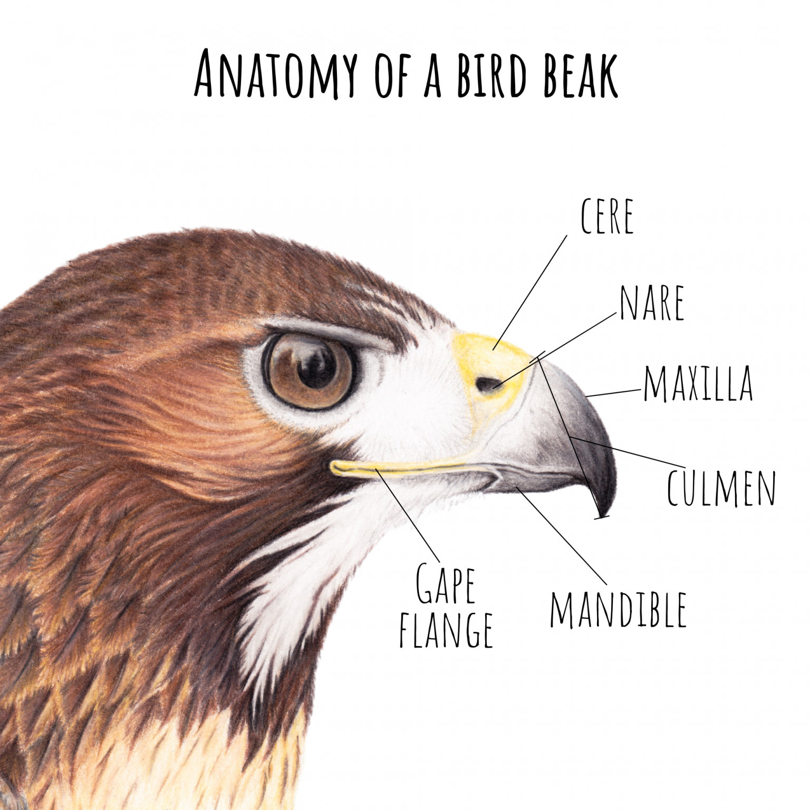

```{r setup, include = FALSE}
knitr::opts_chunk$set(echo = TRUE)
knitr::opts_chunk$set(fig.retina = 3, dpi = 300, fig.width = 6, fig.asp = 0.618, out.width = "80%") # for better picture resolution
```


```{r load-lib, include = FALSE}
library(tidyverse)
library(tidymodels)
library(palmerpenguins)
library(knitr)
library(xaringanthemer)
library(ggplot2)
library(gridExtra)
library(tidymodels)
library(readxl)
```

```{r our-data, include=FALSE}
birds_data_og <- read_csv("Birds/birds_data.csv")

birds_data <- birds_data_og %>%
  select(Species1, Family1, Order1, Avibase.ID1, Total.individuals,
         Complete.measures, Beak.Length_Culmen, Beak.Length_Nares, Beak.Width, Beak.Depth, 
         Tarsus.Length, Wing.Length, Kipps.Distance, Secondary1, Tail.Length, 
         Trophic.Level, Trophic.Niche) %>%
  rename("Species_Name" = "Species1", "Family" = "Family1", "Order" = "Order1",
         "Species_ID" = "Avibase.ID1",
         "Secondary_Length" = "Secondary1",
         "Complete_Measures" = "Complete.measures", "Total_Individuals" = "Total.individuals",
         "Beak_Culmen_Length" = "Beak.Length_Culmen", "Beak_Nares_Length" = "Beak.Length_Nares",
         "Beak_Width" = "Beak.Width", "Beak_Depth" = "Beak.Depth", "Tarsus_Length" = "Tarsus.Length",
         "Wing_Length" = "Wing.Length", "Kipps_Distance" = "Kipps.Distance", "Tail_Length" = "Tail.Length",
         "General_Trophic" = "Trophic.Level", 
         "Niche_Trophic" = "Trophic.Niche") %>%
  relocate(Species_ID, .before = Species_Name)
```
# Introduction 

In this project we want to investigate the correlation between the diets and beak measurements of birds. We want to figure out if you can predict a bird diet based on their beak measurements alone.

### The Bird Beak
:::: {style="display: flex;"}
:::{}

A bird's beak anatomy can vary greatly in size and shape depending on its habitat and diet. A bird uses its for more than just eating, they are also used to build nests and sometimes to fight of other creatures invading their territory. 

Depending on the function a beak is required to carry out for a certain diet, the beak shape and size can vary greatly. e.g.

- A cone shaped beak is used for picking up and cracking seeds easily.

- Broader and flatter beaks are needed to create a larger surface area for bug catching in the air.

- For bug feeding on the groud, beaks are more tweezer-like.

- For meat eating, very strong beaks are required with the tip pointing downwards in order to hook onto the meat easier.

- Long thing beaks with a spear-like tip are great for catching fish.

:::

:::{}
```{r fig 1, echo = FALSE, out.width = "60%", fig.align = "right", fig.cap= "figure 1: Bird Beak Anatomy"}

```
:::
::::

The bird beak is made up of the cere, nare, culmen, maxilla, mandible and gape fillange (see fig. 1). It's useful to note that both the nare and culmen are lengths of the beak that can be measured easily. They differ only as the nare is from nostril to tip whereas the culmen starts from the skull.

### The Diets of Birds

The different diet of birds can be sorted into different trophic level. A trophic level defines the hierarchy of an organism in a ecosystem. The main three trophic levels we will be looking at are:

- Carnivore: A species whose diet consists of at least 70% of food from consuming live animals.

- Herbivore: A species whose diet consists of at least 70% of food from consuming plants. 

We decided to leave out scavenger birds since they make up less than 1% of our data and so using them may of led to false predictions.

We also left out omnivores, this was due to the overlapping diets that they have in correlation to Carnivores and Herbivores. An omnivore is a species whose diet consists of a mixed consumption of plants and animals at an approximately equal rate. This means that their beak measurements doesn't have as definite relationships as the Carnivores and Herbivores, which may have also lead to false predictions.

The main trophic levels can be sub categorised into more niche trophics. Within these categories we found there to be a clearer link between the beak measurements and diets therefore we looked at the most common one, Invertivores to make our model. To be categorised as one the following trophic levels the species must get at least 60% of its diet from the corresponding food resource.

- Frugivore: fruit.

- Granivore: seeds or nuts.
 
- Nectarivore: nectar.

- Herbivore: plant materials in non-aquatic systems, including leaves, buds, whole flowers etc.

- Herbivore aquatic: plant materials in aquatic systems, including algae and aquatic plant leaves.

- Invertivore:invertebrates in terrestrial systems, including insects, worms, arachnids, etc.

- Vertivore: vertebrate animals in terrestrial systems, including mammals, birds, reptiles etc.

- Aquatic Predator: vertebrate and invertebrate animals in aquatic systems, including fish, crustacea, molluscs, etc.

- Scavenger: carrion, offal or refuse.

- Omnivore: Species using multiple niches, within or across trophic levels, in relatively equal proportions.


### Our Data

Our main data set for this project is an AVONET Supplementary Data Set called "birds_data". It contains different bird species measurements and behavior; such as their habitat, diet and migration patterns. 

We will be focusing on the following variables of this data set that are useful in our project:

:::: {style="display: flex;"}

:::{}

- Species ID: Unique identifier for species (or species group) linking to the Avibase dataset which provide detailed information on taxonomy, synonymy and distribution for the world's birds.

- Total Individuals: Number of individual birds measured for each species.

- Complete Measures: Number of measured birds with a complete set of morphometric trait measurements.

- Beak Length: The nares length is measured from the front edge of the nostril to the tip of the beak (see fig 2). We've chosen to focus on nares length over culmen length (the length from the tip of the beak to the base of the skull) as beak width and depth also refer to the nostril location, whereas the culmen length refers to the skull.

- Beak Width: Width of the beak at the front edge of the nostrils (see fig 2).

- Beak Depth: Depth of the beak at the front edge of the nostrils (see fig 2).

:::

:::{}

```{r fig 2, echo = FALSE, out.width = "75%", fig.align = "right", fig.cap= "figure 2: Bird Measurements Taken"}
include_graphics("Birds/Watercolor_painted_beautiful_bird,_Hand_drawn_colorful_bird.jpg")
```

:::

::::

- Tarsus Length: Length from the notch between tibia and tarsus, to the bend of the foot (see fig 2).

- Wing Length: Length from the bend of the wing to the tip of the longest primary feather (unflattened wing) (see fig 2).

- Kipps Distance: Length from the tip of the first secondary feather to the tip of the longest primary feather (see fig 2).

- Secondary Length: Length from the bend of the wing to the tip of the first secondary feather (see fig 2).

- Tail Length: Distance between the tip of the longest tail feather and the point at which the tail protrudes from the skin (see fig 2).

- General Trophic: Main diet level groups (Carnivore, Omnivore, Herbivore, Scavenger)

- Niche Trophic: Niche diet level, sub categories of Tropic Level groups.

# Methods 

### Data Tidying

In order to tidy our original data set we checked for official NAs and located them, selected our required columns to reduce the variable amount, then renamed and reordered the columns to keep them clean and making sense. 

### Data Science Techniques

During our project we have used a multitude of data science techniques. The main ones we have used are as follows:

- We have tidied and wrangled the data in order to make it clear and concise when analysing.

- We have imported the original data set and transcribed into csv format to make it easy for us to read and access.

- For data visualisation we have created many graphs to demonstrate our findings and data.

- For our model, we are using logistic regression as we are predicting a discrete value. 


# Results 

### The Investigation Process

#### General Trophic Level
When investigating the beak data, there are three variables to consider; beak length (nares), beak width and beak depth. Summarising the data from these 3 columns we get:

```{r summary-variables, echo = FALSE}
birds_data %>%
  select(Beak_Nares_Length, Beak_Width, Beak_Depth) %>%
  summary()
```

We can visualise these values in a box plot whilst separating them into their respective General trophic levels:

```{r boxplots, echo = FALSE, fig.align='center'}
boxpt_Length_1 <- birds_data %>%
  filter(General_Trophic != "NA"  & General_Trophic != "Scavenger") %>%
  ggplot(mapping = aes(y = Beak_Nares_Length, x = General_Trophic)) +
  geom_boxplot() +
  labs(y = "Beak Length", x = "Trophic Level") +
  theme(text = element_text(size=8),
        axis.text.x = element_text(angle=0, hjust=1)) 

boxpt_Width_1 <- birds_data %>%
  filter(General_Trophic != "NA" & General_Trophic != "Scavenger") %>%
  ggplot(mapping = aes(y = Beak_Width, x = General_Trophic)) +
  geom_boxplot()+
  labs(y = "Beak Width", x = "Trophic Level") +
   theme(text = element_text(size=8),
        axis.text.x = element_text(angle=0, hjust=1))

boxpt_Depth_1 <- birds_data %>%
  filter(General_Trophic != "NA" & General_Trophic != "Scavenger") %>%
  ggplot(mapping = aes(y = Beak_Depth, x = General_Trophic)) +
  geom_boxplot() +
  labs(y = "Beak Depth", x = "Trophic Level") +
   theme(text = element_text(size=8),
        axis.text.x = element_text(angle=0, hjust=1))

grid.arrange(boxpt_Length_1, boxpt_Width_1, boxpt_Depth_1, ncol = 3)  
```

Discounting the limited data for scavenger birds, these box plots show beak length doesn't differ greatly between trophic levels on average. We can see that Herbivores on average have the widest and deepest beaks but are slightly shorter than the other trophics. 

The trophic levels don't have equal amounts of data, generally the carnavores have many more entries compared to any other column. We don't believe this is due to sampling bias, just due to the fact there are likely more carnivore species of bird in existence compared to others.

```{r trophic-count, echo=FALSE, fig.align='center'}
birds_data %>%
  filter(General_Trophic != "NA" & Niche_Trophic != "NA") %>%
  ggplot(mapping = aes(x = General_Trophic, fill = Niche_Trophic)) +
  geom_bar() +
  labs(title = "Frequency of Trophic Level Species", x = "Trophic Level", y = "Number of Species", fill = "Trophic Niche") +
  theme_bw()
```

#### Niche Trophic Level

As from above you can see that there wasn't a clear disntiction of the bird measurements between different General Trophic Levels. So we decided to have a look at the Niche Trophic Levels.

```{r boxplots 2, echo = FALSE, fig.align='center'}
boxpt_Length_2<- birds_data %>%
  filter(Niche_Trophic != "NA") %>%
  ggplot(mapping = aes(x = Beak_Nares_Length, y = Niche_Trophic)) +
  geom_boxplot(outlier.shape = NA, na.rm = TRUE) +
  labs(x = "Beak Length", y = "Niche Trophic Level") +
  theme(text = element_text(size=8),
        axis.text.x = element_text(angle=0, hjust=1))+
  scale_x_continuous(limits = c(0, 100))

boxpt_Width_2 <- birds_data %>%
  filter(Niche_Trophic != "NA") %>%
  ggplot(mapping = aes(x = Beak_Width, y = Niche_Trophic)) +
  geom_boxplot(outlier.shape = NA, na.rm = TRUE) +
  labs(x = "Beak Width", y = "Niche Trophic Level") +
  theme(text = element_text(size=8),
        axis.text.x = element_text(angle=0, hjust=1))+
  scale_x_continuous(limits = c(0, 40))

boxpt_Depth_2 <- birds_data %>%
  filter(Niche_Trophic != "NA") %>%
  ggplot(mapping = aes(x = Beak_Depth, y = Niche_Trophic)) +
  geom_boxplot(outlier.shape = NA, na.rm = TRUE) +
  labs(x = "Beak Depth", y = "Niche Trophic Level") +
  theme(text = element_text(size=8),
        axis.text.x = element_text(angle=0, hjust=1))+
  scale_x_continuous(limits = c(0, 50))

grid.arrange(boxpt_Length_2, boxpt_Width_2, boxpt_Depth_2, ncol = 3)
```

talk about the different means medians etc idk.


### Modelling the Data

In order to answer our question of is it possible to predict diet based on beak measurements, we will need to use a logistic regression model since this is a discrete variable case.

For our model we will be predicting whether or not a species of bird is a certain trophic level based on its predicting factors of beak length, beak depth and beak width.

Initially, we wanted to try and see whether one predictor (just beak depth) would be a better predictor model than the three predictors, length, width and depth. 

Our first model, model-1, uses only beak depth as a predictor value to predict whether the bird is a carnivore or not. We then made a second model for carnivores that uses all 3 predictor values (beak length, width and depth).

```{r include=FALSE, model-data, echo=FALSE}
#creating a new data set, with a yes no column for herbivore,carnivore and omnivore

birds_model <- birds_data %>%
  filter(!General_Trophic == "NA") %>%
  mutate(
    Carnivore_Status = factor(ifelse(General_Trophic == "Carnivore", "Carnivore", "Not Carnivore"),
                              levels = c("Not Carnivore", "Carnivore")),
    
    Herbivore_Status = factor(ifelse(General_Trophic == "Herbivore", "Herbivore", "Not Herbivore"),
                              levels = c("Not Herbivore", "Herbivore")),
    
    Omnivore_Status = factor(ifelse(General_Trophic == "Omnivore", "Omnivore", "Not Omnivore"),
                             levels = c("Not Omnivore", "Omnivore")))
```

```{r data-split, echo=FALSE, include=FALSE}
#splitting our data

# Set seed for reproducibility
set.seed(123)
# Create an initial split (e.g., 80% training, 20% testing)
split_data <- initial_split(birds_model, prop = 0.8)
train_data <- training(split_data)
test_data <- testing(split_data)
```

```{r include=FALSE, model-1, echo=FALSE}
#model for predicting carnivore based off one factor (model 1)

birds_rec_1 <- recipe(Carnivore_Status ~ Beak_Depth, data = train_data) %>%
  step_dummy(all_nominal(), -all_outcomes())

birds_mod_1 <- logistic_reg() %>%
  set_engine("glm")

birds_wflow_1 <- workflow() %>%
  add_recipe(birds_rec_1) %>%
  add_model(birds_mod_1)

#fit 1
birds_fit_1 <- birds_wflow_1 %>%
  fit(data = train_data)

tidy(birds_fit_1)
```

```{r model-1-roc, include=FALSE}
# Making the predictor
birds_predict_1 <- predict(birds_fit_1, test_data, type = "prob") %>%
  bind_cols(test_data)

# ROC for carnivore
roc_Carnivore_1 <- birds_predict_1 %>%
  roc_curve(truth = Carnivore_Status, ".pred_Carnivore", event_level = "second")

# Plot ROC for carnivore
ROC_1 <- autoplot(roc_Carnivore_1) +
  labs(title = "ROC Model 1")
```

```{r model-c, include=FALSE}
#model for predicting if a carnivore or not based on beak data (model C)
birds_rec_C <- recipe(Carnivore_Status ~ Beak_Nares_Length + Beak_Width + Beak_Depth, data = train_data) %>%
  step_dummy(all_nominal(), -all_outcomes())

birds_mod_C <- logistic_reg() %>%
  set_engine("glm")

birds_wflow_C <- workflow() %>%
  add_recipe(birds_rec_C) %>%
  add_model(birds_mod_C)

birds_wflow_C

#fit c
birds_fit_C <- birds_wflow_C %>%
  fit(data = train_data)

# Making the predictor
birds_predict_C <- predict(birds_fit_C, test_data, type = "prob") %>%
  bind_cols(test_data)

# ROC for carnivore
roc_Carnivore <- birds_predict_C %>%
  roc_curve(truth = Carnivore_Status, ".pred_Carnivore", event_level = "second")

# Plot ROC for carnivore
c_ROC <- autoplot(roc_Carnivore) +
  labs(title = "ROC Model c")
```

```{r equations-1-c, include=FALSE}
tidy(birds_fit_C)
tidy(birds_fit_1)
```

Comparing model-1 to model-c we first look at their equations:

- Model 1: predicted carnivore true = 0.476 - 0.033 * Beak_Depth

- Model c: predicted carnivore true = 0.410 + 0.030 * Beak_Nares_Length - 0.002 * Beak_Width - 0.086 * Beak_Depth

stuff about what this means :)

The ROC of models 1 and c are below:

```{r model-c&1, echo=FALSE, fig.align='center'}
grid.arrange(ROC_1, c_ROC, ncol = 2)
```

```{r model-h, include=FALSE}
#model for herbivores

birds_rec_h <- recipe(Herbivore_Status ~ Beak_Nares_Length + Beak_Width + Beak_Depth, data = train_data) %>%
  step_dummy(all_nominal(), -all_outcomes())

birds_mod_h <- logistic_reg() %>%
  set_engine("glm")

birds_wflow_h <- workflow() %>%
  add_recipe(birds_rec_h) %>%
  add_model(birds_mod_h)

birds_wflow_h

#fit h
birds_fit_h <- birds_wflow_h %>%
  fit(data = train_data)

# Making the predictor
birds_predict_h <- predict(birds_fit_h, test_data, type = "prob") %>%
  bind_cols(test_data)

# ROC for herbivore
roc_Herbivore <- birds_predict_h %>%
  roc_curve(truth = Herbivore_Status, ".pred_Herbivore", event_level = "second")

# Plot ROC for herbivore
h_ROC <- autoplot(roc_Herbivore) +
  labs(title = "ROC Model h")
```

```{r model-o, include=FALSE}
#model for omnivores

birds_rec_o <- recipe(Omnivore_Status ~ Beak_Nares_Length + Beak_Width + Beak_Depth, data = train_data) %>%
  step_dummy(all_nominal(), -all_outcomes())

birds_mod_o <- logistic_reg() %>%
  set_engine("glm")

birds_wflow_o <- workflow() %>%
  add_recipe(birds_rec_o) %>%
  add_model(birds_mod_o)

birds_wflow_o

#fit o
birds_fit_o <- birds_wflow_o %>%
  fit(data = train_data)

# Making the predictor
birds_predict_o <- predict(birds_fit_o, test_data, type = "prob") %>%
  bind_cols(test_data)

# ROC for omnivore
roc_Omnivore <- birds_predict_o %>%
  roc_curve(truth = Omnivore_Status, ".pred_Omnivore", event_level = "second")

# Plot ROC for omnivore
o_ROC <- autoplot(roc_Omnivore) +
  labs(title = "ROC Model o")
```

```{r modelcho, include=FALSE}
tidy(birds_fit_C)
tidy(birds_fit_h)
tidy(birds_fit_o)
```

Comparing model-c to model-h and to model-o we first look at their equations:

- Model c: predicted carnivore true = 0.410 + 0.030 * Beak_Nares_Length - 0.002 * Beak_Width - 0.086 * Beak_Depth

- Model h: predicted carnivore true = -1.185 - 0.039 * Beak_Nares_Length - 0.002 * Beak_Width + 0.106 * Beak_Depth

- Model o: predicted carnivore true = -1.523 - 0.002 * Beak_Nares_Length + 0.0019 * Beak_Width - 0.023 * Beak_Depth

stuff about what this means :)

The ROC of models c, h and o are below:

```{r cho-ROC-plot, echo=FALSE, fig.align='center'}
grid.arrange(c_ROC, h_ROC, o_ROC, ncol = 3)
```

### Discussion – Answers your research question(s). What are the advantages/limitations of the investigation you have performed? If applicable, are there any ethical considerations in relation to your investigation/findings?

```{r model-evaluation}

```


references:
- figure 1: https://www.vecteezy.com/png/25217819-watercolor-painted-beautiful-bird-hand-drawn-colorful-bird

- bird beaks: https://burleydamgardencentre.co.uk/blog/what-are-the-different-types-of-bird-beaks/

- fig 1: https://kaylafisk.com/tag/drawing/